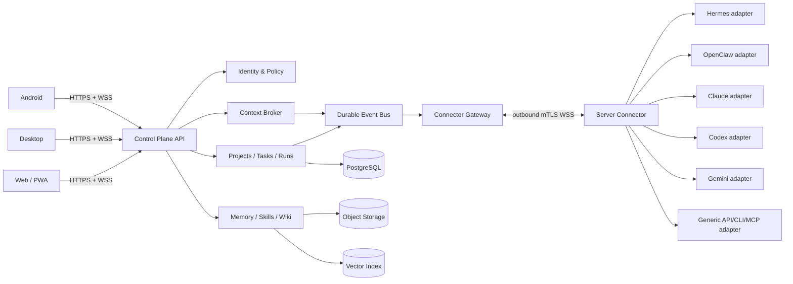
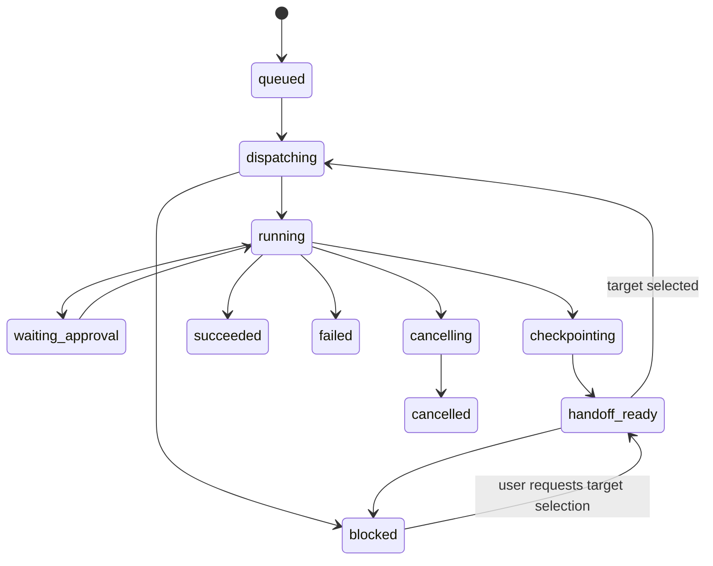

# Архитектура Agent Control Center

**Версия:** 0.1.0-draft
**Дата:** 2026-07-19
**Нормативность:** supporting architecture; при конфликте приоритет у `SPECIFICATION.md`.

## 1. Контекст

Система разделяется на центральный Control Plane и один или несколько Connector, установленных рядом с серверными агентами. Клиенты не подключаются к агентам напрямую. Connector устанавливает исходящее mTLS/WebSocket-соединение, поэтому MVP не требует открывать входящий порт на каждом сервере агента.



## 2. Клиенты

Предлагаемый baseline, подлежащий утверждению ADR:

- **UI core:** React + TypeScript, responsive design, offline-capable read cache.
- **Web:** PWA, основной административный клиент.
- **Desktop:** Tauri wrapper для native notifications, secure local storage и controlled file pickers.
- **Android:** Capacitor wrapper над тем же UI core; native bridge только для push, biometrics, share/open-file и encrypted storage.

Запрещено помещать provider/server credentials в web bundle. Desktop/Android хранят только refresh credential устройства в OS keystore. Все provider credentials остаются на Connector или в серверном secret manager.

## 3. Control Plane компоненты

| Компонент | Ответственность | Не отвечает за |
|---|---|---|
| API Gateway | REST/WS, schema validation, idempotency, rate limits | бизнес-оркестрацию |
| Identity & Policy | OIDC/local bootstrap, RBAC/ABAC, device sessions, approvals | provider auth внутри Connector |
| Project Service | workspaces, projects, tasks, dependencies, artifacts | запуск runtime |
| Run Orchestrator | run state machine, leases, retries, cancel, handoff | интерпретацию vendor payload |
| Connector Gateway | регистрацию Connector, command/event delivery, health | исполнение adapter process |
| Context Broker | сбор bounded context bundle, redaction, token budgeting | хранение скрытого chain-of-thought |
| Memory Service | scoped/versioned memory, provenance, conflicts, retrieval | автоматическое объявление непроверенных выводов фактами |
| Skill Registry | immutable versions, review/signature state, compatibility | молчаливое выполнение skill-кода |
| Wiki Service | Markdown pages, versions, links, search | замена source artifacts |
| Usage Service | нормализованные usage/quota/budget signals | обещание точного остатка при отсутствии API |
| Audit Service | append-only security and lifecycle events | хранение секретов и полного sensitive content |
| Notification Service | in-app/push/email hooks, dedupe | authoritative task state |

## 4. Connector

### 4.1 Trust boundary

Connector — отдельный сервис с уникальной identity и минимальными правами. Он:

1. устанавливает только исходящее соединение;
2. исполняет команды с lease/idempotency key;
3. запускает adapters в отдельных OS identities/containers, где возможно;
4. не передаёт секреты в Control Plane;
5. redacts события до отправки;
6. хранит короткий encrypted spool при разрыве связи;
7. не принимает новый destructive action без policy/approval token.

### 4.2 Agent Adapter Protocol (AAP)

Версионированный внутренний контракт:

```text
handshake() -> identity, adapter_version, runtime_version, capabilities
health() -> status, latency, active_runs
start(run_spec, context_bundle, approval_token?) -> native_run_ref
stream(native_run_ref, cursor) -> ordered normalized events
checkpoint(native_run_ref, reason) -> observable checkpoint
cancel(native_run_ref, mode) -> outcome
resume(native_run_ref | checkpoint) -> outcome
usage(scope) -> measured|estimated|unknown signal
artifacts(native_run_ref) -> metadata + content references
```

Обязательные envelope-поля: `schema_version`, `connector_id`, `agent_id`, `run_id`, `event_id`, `sequence`, `occurred_at`, `classification`, `payload`, `vendor_extension`. Команды идемпотентны; события дедуплицируются по `(connector_id,event_id)`.

Capabilities включают как минимум: `stream`, `cancel`, `native_resume`, `checkpoint`, `approvals`, `tools`, `mcp`, `artifacts`, `usage_exact`, `usage_estimated`, `filesystem_scope`, `structured_output`. Отсутствующая capability никогда не симулируется молча.

## 5. Run и handoff state machine



Handoff — новая attempt в рамках той же TaskRun lineage, а не перенос непрозрачной provider session. Handoff bundle содержит objective, acceptance criteria, bounded conversation, verified memory, decisions, completed/pending work, artifact refs, observed errors и provenance. Target adapter подтверждает ingestion; только после этого lease предыдущего attempt закрывается.

Автоматический fallback в MVP может **предложить** target, но не запускает платный или более привилегированный runtime без policy и, где требуется, user approval. Из `blocked` пользователь возвращает run в `handoff_ready`, чтобы выбрать совместимый target, либо явно отменяет run через обычный cancel flow.

## 6. Общий контекст

### 6.1 Scopes

`organization -> workspace -> project -> task -> run`; отдельно существуют `user-private` и `agent-private`. Более узкая область наследует разрешённые записи широкой области, но не наоборот.

### 6.2 Memory entry

Поля: `id`, `scope`, `kind`, `content`, `summary`, `provenance`, `confidence`, `verification_state`, `sensitivity`, `valid_from`, `valid_until`, `supersedes`, `acl`, `created_by`, `created_at`, `content_hash`.

Kinds: fact, decision, constraint, preference, lesson, entity, artifact_reference, run_summary. Непроверенный вывод агента имеет `verification_state=unverified`; conflict не перезаписывается, а создаёт новую версию и conflict record.

### 6.3 Skills

Skill package содержит manifest, Markdown instructions, optional assets/scripts, compatibility, permissions, provenance, digest, signature/review state. Версии immutable. Активация executable части требует policy review; downloaded/untrusted package по умолчанию quarantined.

### 6.4 Wiki

Markdown source, immutable revisions, backlinks, aliases, attachments, ACL и full-text/semantic search. Автосформированная страница сначала draft и показывает источники; публикация в authoritative namespace требует review.

## 7. Данные

Основные сущности:

- Organization, User, DeviceSession, RoleBinding;
- Workspace, Project, Task, TaskDependency, AcceptanceCriterion;
- Connector, Agent, Adapter, CapabilitySnapshot, CredentialReference;
- Conversation, Message, TaskRun, RunAttempt, RunEvent, Approval, Checkpoint;
- Artifact, ArtifactVersion;
- MemoryEntry, MemoryVersion, MemoryConflict;
- Skill, SkillVersion, SkillActivation;
- WikiPage, WikiRevision, WikiLink;
- UsageSignal, BudgetPolicy, AuditEvent, Notification.

PostgreSQL — authoritative metadata; object storage — artifacts/packages; vector index — derived retrieval index. Удаление vector index не должно уничтожать source content; индекс полностью перестраиваем.

## 8. API baseline

REST commands используют `Idempotency-Key`; event subscriptions — WSS с resume cursor.

```text
POST   /v1/workspaces
GET    /v1/projects/{projectId}
POST   /v1/projects/{projectId}/tasks
PATCH  /v1/tasks/{taskId}
POST   /v1/connectors/enrollment-tokens
GET    /v1/agents?project_id=&capability=
POST   /v1/tasks/{taskId}/runs
POST   /v1/runs/{runId}/approvals/{approvalId}
POST   /v1/runs/{runId}/checkpoint
POST   /v1/runs/{runId}/handoffs
POST   /v1/runs/{runId}/cancel
GET    /v1/runs/{runId}/events?cursor=
POST   /v1/memory/query
POST   /v1/memory/entries
POST   /v1/skills/{skillId}/versions
POST   /v1/skills/{skillId}/activations
PUT    /v1/wiki/pages/{pageId}
GET    /v1/usage/summary
GET    /v1/audit/events
WS     /v1/events?cursor=
```

Error envelope: `code`, `message`, `correlation_id`, `retryable`, `details`. Optimistic writes use `If-Match`/revision. Server timestamps are authoritative.

## 9. Deployment baseline

- self-hosted single-node MVP: container compose, PostgreSQL, S3-compatible storage, embedded/managed queue;
- production profile: redundant stateless API, managed PostgreSQL/object store, durable queue, separate workers;
- Connector upgrades are staged, signed, rollback-capable and never forced during active run;
- configuration is declarative; secrets supplied only through secret manager/file descriptors, not committed env files;
- migrations are forward-compatible for one release and have restore-tested rollback/roll-forward procedure.

## 10. Threat model summary

Threat actors: compromised agent, malicious skill, prompt injection in artifact/wiki, stolen device, rogue Connector, tenant user exceeding privilege, supply-chain compromise, replayed command, poisoned memory.

Controls: tenant isolation, mTLS device identity, short-lived command tokens, RBAC/ABAC, human approvals, immutable audit, content classification/redaction, egress policy, adapter sandbox, skill quarantine/signatures, provenance-aware retrieval, idempotency/replay protection, secret references, encrypted backup, revocation.

## 11. ADRs required before implementation

1. ADR-001 UI wrappers: Tauri + Capacitor versus alternative shared-client stack.
2. ADR-002 deployment topology and supported database/queue profile.
3. ADR-003 authentication: local bootstrap, OIDC providers, enterprise SSO phase.
4. ADR-004 vector backend and embedding data residency.
5. ADR-005 Connector sandbox baseline for Linux/Windows/macOS servers.
6. ADR-006 adapter SDK language and process isolation model.
